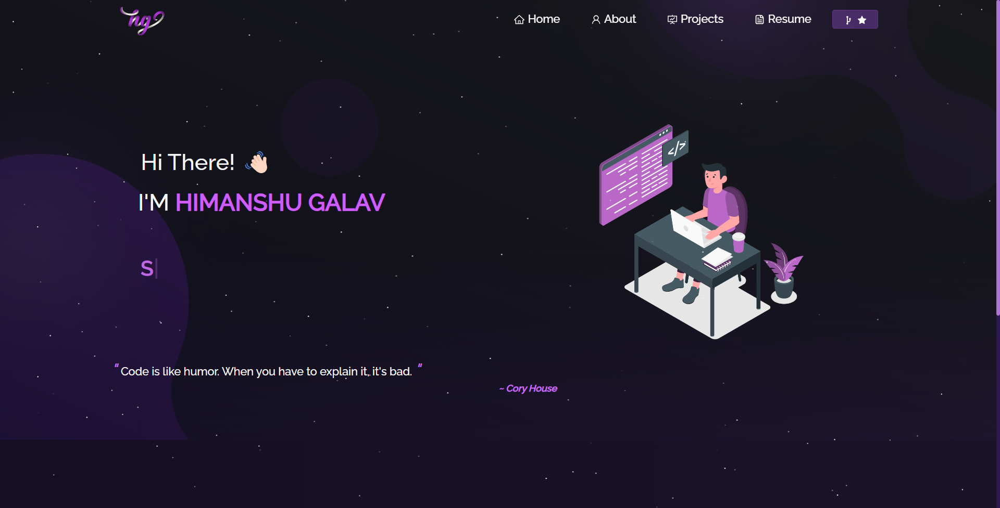
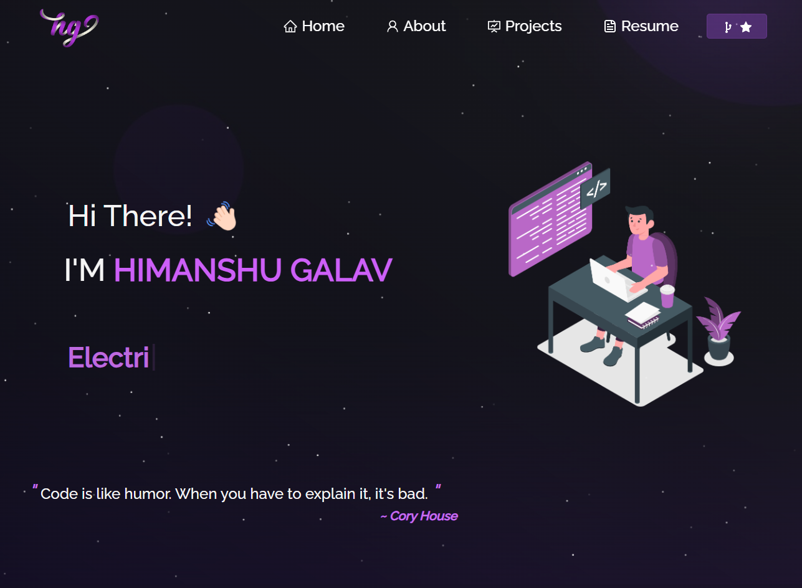
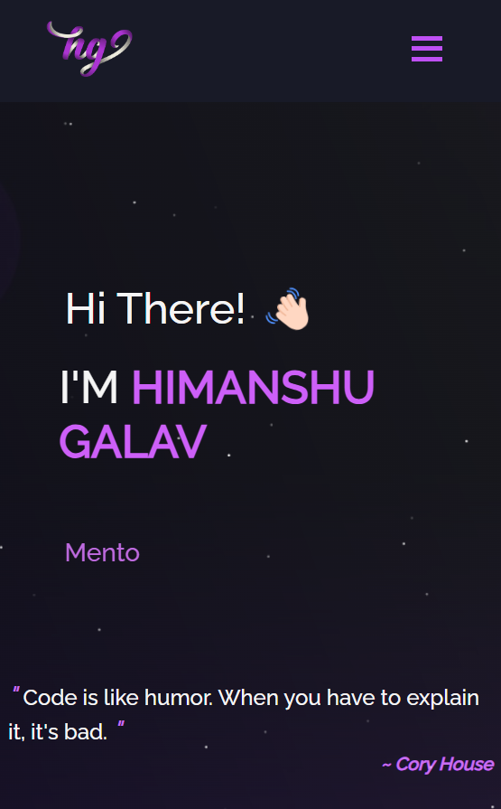

<h2 align="center">
  Portfolio Website - 
  <a href="https://himanshugalav1.github.io/portfolio/" target="_blank">HIMANSHU_PORTFOLIO</a>
</h2>
 
 

  
  <h3 align="center">Laptop Preview</h3>

 

  
   

<h4 align="left">Tab Preview</h4>
<h4 align="right">Mobile Preview</h4>

## Built With
This project was built using these technologies.
- React.js
- Node.js
- CSS3
- HTML5
- VsCode

## Features
- Multi Page Layout
- Styled with React-Bootstrap and CSS
- Fully Responsive

## Getting Started

Clone down this repository or download the zip folder. 
Then install `node.js` and `git`.

## Installation and Setup Instructions

1. Installation: `npm install`, run this command to install all the required node files
2. In the project directory, you can run: `npm start` to start the website on localhost server

## Usage Instructions

Open the project folder and Navigate to `/src/components/`.  
You will find all the components used and you can edit your information accordingly.
